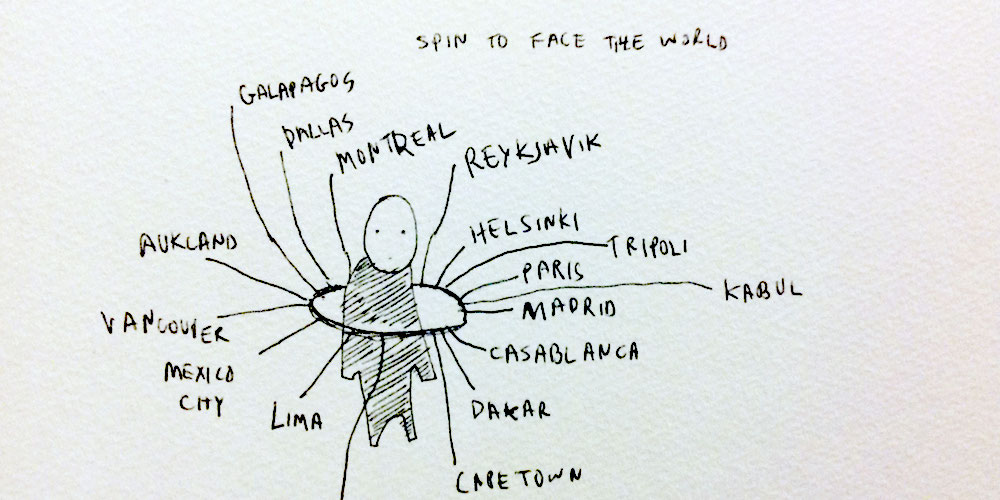

One of the things I enjoy about radio is this notion of liveness, that someone somewhere is talking, singing, shouting at you through the air, and the fact that you can easily scan through cultures by changing the dial.  In NYC for example, when you step into a cab you can just as easily hear an meringue music or someone on the radio speaking french, etc.  There’s something very universal about this. 

When I first discovered the internet (back when web-rings were big!), internet radio was one of the first streaming medias there was to consume.  I found things like real player and shoutcast.  There was something very magical about the web at that time, it was kind of the wild west, and internet radio always brings me back there. 

Also, we are so often really unaware of our orientation in the world.  For example -- where is Tokyo in relationship to where you are standing now?  Where’s cairo?  Or Bogota?  The idea that by turning 360 degrees you can orient yourself towards anywhere in the world is a simple and important notion I’d like to explore here.  I always find for example, this great moment coming out of the subway at a new stop where you don’t know which way you are facing there’s something really magical which happens where your brain has to map your model of the world to your sensory perception of the world.  I think those moments of orientational awareness will be interesting to experiment with. 

Finally, I’m intrigued with granular approaches to media - if we cut down images / sounds / text into small, malleable pieces what can build with them?   The poet <a href="http://en.wikipedia.org/wiki/Kenneth_Goldsmith" target="_blank">Kenneth Goldsmith</a> quotes the conceptual artist, <a href="http://en.wikipedia.org/wiki/Douglas_Huebler" target="_blank">Douglas Huebler</a>, when describing his <a href="http://chronicle.com/article/Uncreative-Writing/128908/" target="_blank">style of teaching uncreative writing</a> (where the students are not allowed to write any new words),  

> The world is full of objects, more or less interesting; I do not wish to add any more.

I think there’s something really beautiful about using all the material out there in new ways.

