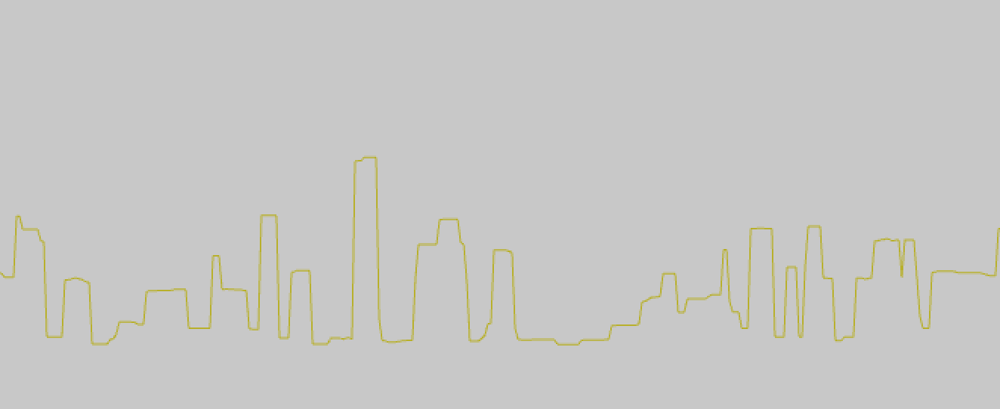
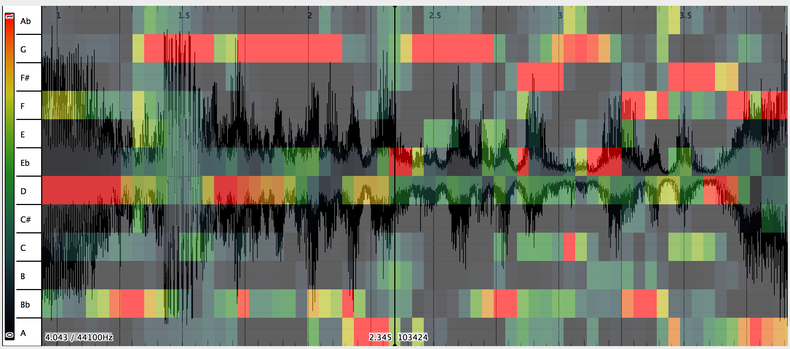

another approach we are exploring is using melody extraction tools to find notes.  [Melodia](http://www.justinsalamon.com/melody-extraction.html), a tool created by Justin Salamon, is one things we've been trying.  We've been using it via [VAMP](http://vamp-plugins.org/) an amazing plugin system for audio analysis.  If you have any interest in experimenting with different audio analysis tools, I encourage you to check out vamp.

Here's a look at the segmentaiton tool we built, trying to find "notes" in a recording from arabic radio:

https://www.youtube.com/watch?v=pcZoRNrGUCA

and from reggae music: 

https://www.youtube.com/watch?v=sEWfCbY3_Xs

Here we are playing those notes the system has found, with very little context around the note (so they can sound a bit short, but feel maybe more focused): 

https://www.youtube.com/watch?v=dqMZXBcOyiY

it's more musical then before, but still not really that great.  We have alot of work to do!  (note, we also dont' have a lot of samples here which is why this sounds repetitive).  Note the reggae horns at about 2:00 get me every time :)

At this point in the project, everything kinds of looks like a chart :)  sometimes the charts look quite nice and magical, like this smoothed pitch readout that looks like a city: 

Another thing we are starting to research is chroma, which identifies notes, not pitches, of a sound.  It doesn't distinguish the octave -- just if it's a C or E note in the sound that's playing.  

We were encourage by an email from a researcher in melody extraction, [Benoit Fuentes](benoit-fuentes.fr), who writes: 

> Maybe you've tried too precise and sofisticated algorithms, not so robust to noise and polyphonic music.
> If I were you, I would consider radio samples as a texture defined by two parameters :
>  - the maximum of the chroma (http://labrosa.ee.columbia.edu/matlab/chroma-ansyn/) corresponding to the main pitch, regardless of its octave 
>  - the spectral centroid (http://en.wikipedia.org/wiki/Spectral_centroid), corresponding to the brightness of the sound

We've got a feeling like this might prove to be really helpful.  This is a screenshot of a chroma analysis of a small audio sample.  I am using sonic visualizer (http://www.sonicvisualiser.org/), a tool for testing VAMP plugins, and the NNLS chroma plugin (http://isophonics.net/nnls-chroma). 

as a side note, if you are into image processing, check out chromaprint and this article about chroma used for audio identification: 

- http://acoustid.org/chromaprint
- https://oxygene.sk/2011/01/how-does-chromaprint-work/

