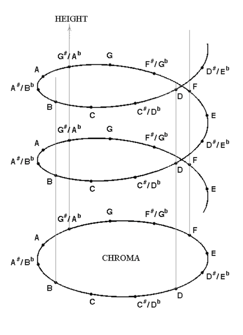
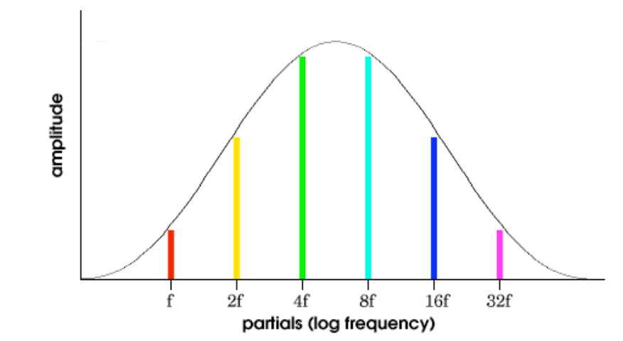

I'm starting to experiment with chroma as a way of identifying notes.  Chroma is essentially a kind of pitch detection that doesn't care about octave.  If you think about pitch like a wheel, where the same note in different octaves is the same angle around the wheel, you've got chroma.  In the case of western musical notation we split this into 12 segments: 

It's easier to see if you imagine chorma as as spiral, where the octave of the note is the height on the spiral: 

Here we are interested in the top down view.  For a given piece of audio, at this moment, how strong is the "a", "b", "b flat" that we are hearing?  Many pitch detectors have problem with octave, and this approach actually looses the octave info.  (note: we can make guesses about octave later by looking at other frequency info).

Technically chroma is computed by remapping the frequency transform so the bins map to more to musical notes.  It's very similar to how you might use FFT to figure out how much bass, midtone or trebble there is in a note.  In this case, we are looking at the strength of all the partials of a given note in the frequency space. 

Chroma is often used for audio analysis.  The Chromaprint project is a good example, where it distills down music into simple graphical patterns (thrrsholeded chroma over time), which are easy to match against other patterns. 

Using VAMP I found a chroma plugin that produces a big pile of numbers: 

This is essentially chroma calculation per chunk of audio. My next job was to make sense of this (!).  I normalized the values, then tried to threshold based on how strong a given chroma reading for a note was and how weak the other ones were.  (ie, I want to find strong notes but not chords).  Here's a quick sketch of that: 

https://www.youtube.com/watch?v=7czPTRmGxBc&feature=youtu.be

What's intersting is that chroma also relates to shepard tones, the auditory illusion that creates a sound that always rises or lowers: 

http://en.wikipedia.org/wiki/Shepard_tone

https://vimeo.com/34749558

Shepard tones are based on partials (like chroma) so you can use shepard tones to "recreate" audio that's been analyzed by chroma -- using the chroma info to play shepard tones.  Here's a small experiment with trying to recreate radiohead: 

https://soundcloud.com/thesystemis/radioheadchroma

Finally, there's tons of info here: 

- http://recherche.ircam.fr/equipes/analyse-synthese/peeters/ARTICLES/Peeters_2006_ISMIR_KeyHPS.pdf
- http://www.nyu.edu/classes/bello/MIR_files/tonality.pdf
- http://labrosa.ee.columbia.edu/matlab/chroma-ansyn/
- http://www.mpi-inf.mpg.de/resources/MIR/chromatoolbox/
- http://en.wikipedia.org/wiki/Pitch_class